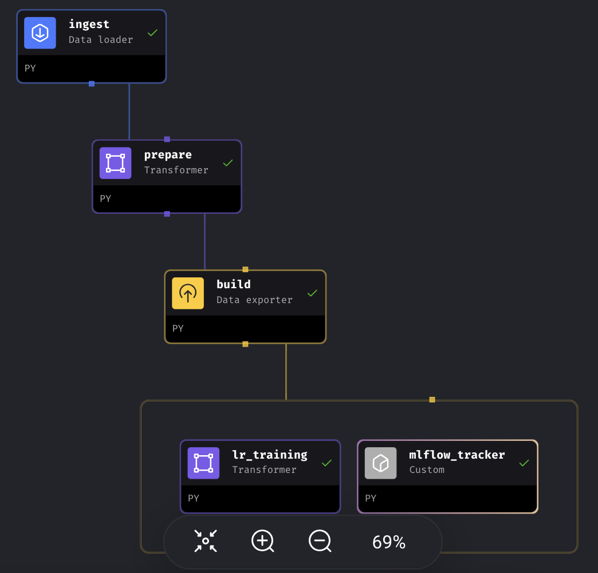

### Orchestration
Create a virtual docker environment with the docker compose file. Change the directory to this folder `03-model-deployment` and launch the server with `./scripts/start.sh`.
- The `metadata.yaml`, `settings.yaml` and `requirements.txt` must be present to install environment packages and make sure that mage recognizes the project as a *multi-project* environment. I hardcoded the project name in the metadatafile as `mlops` to match the .env file. It can be modified as required in the metadata and .env files respectively.
- In the `docker-compose.yaml` file, the postgres server, mage server, and mlflow server are sharing the same network `app-network`
- Once the server is launched, click on 
    - `http://localhost:6789` to access the ***MAGE UI*** server
    - `http://localhost:3500` to acess the ***MLFlow UI*** server
<br>

- The default project is `homework_03`. You can either use it or create a new mage project.
<br>

1. ***Register*** the selected project from the MAGE UI settings page *(I couldn't implement this step because it created a single mage project setup because I didn't copy the entire mlops folder)*.
2. Create a pipeline to ingest the data. The parquet file can be obtained from nyc website with
    ```python
    response = requests.get(
        f'https://d37ci6vzurychx.cloudfront.net/trip-data/yellow_tripdata_{year}-{month:02d}.parquet'
    )
    ```
3. I couldn't register the data pipeline as a `custom data product`, so I just appended a transformer and custom python block for the LR intercept question and MLFlow logging respectively.
<p align="center">
  <br>
  <span>Single pipeline architecture for assignment.</span>
</p>

4. In the mage UI scripts, the mlflow uri is accessed at `http://mlflow:3500`. Autolog was giving me issues with the sklearn version in the mage docker environment, so I logged artifacts manually. Artifacts were logged using a temporary folder name, so it was complex to save the preprocessing dictVec and model in different folders.

The files to replicate the assignment are in the mage setup and the docker container can be easily replicated.