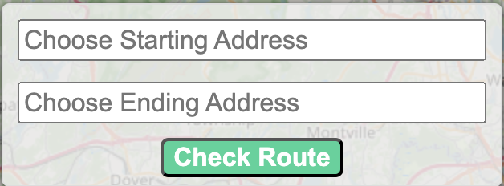

### Project Description
This project aims to predict the number of motor vehicle incidents based on `location_id | dayOfWeek | hourOfDay` in NYC. This can provide crash history alerts to drivers at the start of their journey (by modeling a preferred route between two points in this simple implementation) or dynamic alerts based on proximity to a specific location as the crow flies on their chosen routes. The project idea was inspired by a [Waze alert](https://blog.google/waze/crash-history-alerts-arrive-to-the-waze-map/) that I got on a recent journey.

### Live Deployment
You can view some of the live links for serving predictions. This is currently open to the public for grading purposes but can be closed for private development.
- mlflow server at http://34.228.105.45:5150. 
- nyc-map for serving the model on frontend http://34.228.105.45:9300.
> There are some bugs with how errors are handled in the server logic so sometimes it doesn't give a response if nan values are encountered in the location_ids. You can try curl to get explicit errors or use popular places in new york for testing. Also make sure the two markers are within the valid locations on the map. It was designed to meet the mlops implementation workflow, and the web server logic is still a bit buggy.

### Content
- [Dataset](#dataset)
- [Simplified Docker Environment Setup](#simplified-docker-environment-setup)
- [Manual Environment Setup](#manual-environment-setup)
- [Unit and Integration Testing](#unit-and-integration-testing)
- [Serving Static Predictions](#serving-predictions-with-docker-and-pretrained-model)
- [Serving Predictions with Orchestration](#serving-the-predictions-with-a-trainingretraining-pipeline-for-remote-deployment)
- Useful tools and tips
  - [frontend](#frontend-tools)
  - [backend](#backend-tools)
  - [docker](#docker-tips)
  - [live deployment learnings](#live-deployment-learnings)
  - [reverse proxy nginx](#reverse-proxy-with-nginx)


### Dataset
Motor Vehicle Collision [MVC](https://data.cityofnewyork.us/Public-Safety/Motor-Vehicle-Collisions-Crashes/h9gi-nx95/about_data) is obtained from the NYC opendata api. The [api](https://data.cityofnewyork.us/resource/h9gi-nx95.json) is limited to only 1000 rows, so data is chunked at daily intervals. For simplicity, only entries with longitude and latitude are used within the workflow.

### Simplified Docker Environment Setup
The project has 3 major components, a backend for training the model, a web server (gunicorn) for serving the predictions, and a frontend for accessing the webserver. Considering the complexity of setting up each individual component, the major components were containerized into a different docker services that share the same internal networks. <br>

<p align="center">
  <br>
  <span>High-level <a href="https://app.diagrams.net/#G1JVIVDp0aMvgpFDvYP3sZfGNawJZn3Xmi#%7B%22pageId%22%3A%22Ht1M8jgEwFfnCIfOTk4-%22%7D">architecture</a>.</span>
</p><br>

The model registry saves artifacts to an s3 bucket so you'll need to configure aws-cli first. Once you have an access key, secret acccess, and default region, you can create a `.env` file and save your credentials within it like
```bash
export AWS_ACCESS_KEY=XXXXXXX
export AWS_SECRET_KEY=XXXXXX
export AWS_Zone=us-east-1
export S3_URI=s3://mlflow-artifacts-zmcp24/
```
Activate the environment in your terminal with `source .env` (for mac and linux), then launch all the services with `docker-compose up -d` from the *`repo/project`* directory. This creates 6 services simulataneously. A few of the services spin up faster than others so you might need to wait a bit. The services, entrypoints, and image sizes on a mac are shown below

| Service Name | Entrypoint | Size (GB) |
| :----------- | :--------: | :-------: |
| adminer | http://localhost:8080 | 0.25 |
| db | http://localhost:5436 | 0.43 |
| grafana | http://localhost:3000 | 0.44 |
| mlflow | http://localhost:5150 | 1.23 |
| mlserver | http://localhost:8534 | 2.83 |
| appserver | http://localhost:8536 | 2.31 |
| webpack | http://localhost:9300 | 0.29 |

For the 6 services, only ***Adminer,Mlflow, Grafana, and Webpack*** have a visible UI when you click the link.

### Orchestration
- [Setup python in github actions](https://github.com/actions/setup-python)
  - Cache the pip install to reduce reinstallation time whenever the script is run
- Add Repository secrets to `https://github.com/user/repo_name/settings/secrets/actions`
  - [Generate personal access tokens](https://github.com/settings/apps)
  - Include additional secrets for mlflow server address and aws secret keys
- Schecule it a s a cron job for 28th of each month.

### Manual Environment Setup
Run `make setup` to install the backend environment and dependencies. This installs all the poetry dependencies. Run `make train` to start an mlflow server, create a simple training pipeline, and launch a gunicorn server with the best model from the training step to serve predictions. Once the server is up and running, you can query the server using curl like
```bash
curl -X POST -H "Content-Type: application/json" -d '{
  "coords": {
    "start-address": {
      "lng": "-73.7793733748521",
      "lat": "40.642947899999996"
    },
    "end-address": {
      "lng": "-74.0098809",
      "lat": "40.706619"
    }
  }, 
  "cutoff": "3"
}' http://0.0.0.0:8534/predict_collisions
```
> You will have to kill the gunicorn server manaully when you're done if you implement this step. This isn't tested on Windows.
Example
```bash
# Look for the process that has "--bind 0.0.0.0:8534 pkg.app.server:app" and get the starting id
pgrep -fl gunicorn
kill 11894
```

<br>

For the frontend, navigate to the frontend directory with `cd ../frontend`. Make sure you have `node` and `npm` installed. Install the packages and start the front end server with
```bash
npm install
npm run serve 
```
Ensure port 9300 is available and click on http://localhost:9300/ to access the frontend. Then you can test routes for collision responses. If it only returns the routes, the number of collision incidents in that hour is less than the default high-cutoff of 3 events per hour. Exit the frontend server with `Ctrl + C`.

### Unit and Integration Testing
Run the integration tests with `make integration_test`. This requires docker, spins up a localStorage and mlfow image, tests the data request and training pipeline before cleaning up the containers and environment. The integration test runs internal unit tests.

### Serving Predictions with Docker and Pretrained Model
To serve the predictons from the model, you only need the `appserver` and `webpack` services. Comment out the other services in the `docker-compose.yaml` file to avoid running into *out of memory errors*. `appserver` has a saved model artifact from previous hyperparameter tuning runs that is hosted on a gunicorn server to generate traffic incident predictions. `webpack` service has a simple webpack dev-server frontend for sending queries to the server. <br>

The concept of the problem is you search for two locations in New York within the address form and click on the `check route` button. 
<p align="center">
  <span>
  </span><br>
  <span>Search for an address.</span>
</p>
The addresses are geocoded by the frontend and the coordinates are sent to the backend server. The server traces the driving route to both destinations using OpenStreetMaps road network, and finds all the intersecting boroughs along your route. The time of the day, day of the week, and location_ids are used to predict the number of incidents at that time of the day. <br>
Boroughs with a prediction of more than 3 incidents per hour are shaded in red on the map (as having higher risk of incidents at that time of the day/day of week) and the route between both points is plotted. The names of any boroughs can be visualized by clicking on them.
<p align="center">
  <br>
  <span>High risk boroughs for travel along route in NY local time.</span>
</p><br>

If you don't want to use the frontend, you can also query the server using curl or postman. An example curl query is 
```bash
curl -X POST -H "Content-Type: application/json" -d '{
  "coords": {
    "start-address": {
      "lng": "-73.7793733748521",
      "lat": "40.642947899999996"
    },
    "end-address": {
      "lng": "-74.0098809",
      "lat": "40.706619"
    }
  }, 
  "cutoff": "3"
}' http://0.0.0.0:8536/predict_collisions
```
This returns a json with 3 keys `boroughs | incidents | route` that contains the names of high risk boroughs, predicted incidents, and the route geojson that is plotted. If there are no incidents, the first 2 keys are empty.
> The route calculation step is relatively slow so it might be a couple of seconds (~5s) to get a response.

### Serving the Predictions with a Training/Retraining Pipeline for remote deployment
The prior two container services (`appserver` & `webpack`) have no training/orchestration functionality and mainly represent the deployment step. Running the 6 services simulataneously requires significant storage space, so you make sure your local/remote instance has a enough storage to avoid build errors. In my tests, I either ran the the first 4 services for *training*, *orchestration*, and *monitoring* separately, or the 2 services for demonstrating the functionality. <br>

The training pipeline is saved within the `mlserver` service in the docker-compose file. The service uses the postgres `db` service for storing mlflow records and saves the artifacts to an s3 bucket.  If you don't want s3, you can modify the `docker-compose.yaml` file, and remove the `--default-artifact-root` argument from the command step of the *mlflow service*. This can limit other steps like orchestration etc.
```bash
services:
  mlflow:
    command: mlflow server -h 0.0.0.0 -p 5150 --backend-store-uri=postgresql://postgres:zmcp24@db:5432/mlflowdb --default-artifact-root=${S3_URI}
```

1. Launching this service starts with 
  - training a series of ensembles model (sklearn & xgboost) from scratch, 
  - performs hyperparameter tuning on the best 3 model,
  - ranks the models and promotes the best model for predictions
  The training pipeline contains a data preprocessing pipeline that cleans the input data from the nyc api and generates the appropriate features for serving predictions.
2. The service also simulates a monitoring service using the `evidently` package that tracks missing values, model prediction drift, rmse errors, and data drift. Data is pulled dynamically from the nyc open dataset api, and the results are saved to the postgres `db` service. The results are displayed using the `grafana` service dashboard.
<p align="center">
  <br>
  <span>Monitoring dashboard for April 2023.</span>
</p>

3. The best model is served using gunicorn at `http://0.0.0.0:8534/predict_collisions`. It can be queried using curl by changing the port address from the previous example. You can also modify thr existing server address for the `webpack` service in docker-compose to point to this server
    ```bash
    x-environment: &default-environment
      APP_SERVER_HOST: "http://localhost:8534"
    ```
    - **Note:** Docker kept running out of memory if the `appserver` and `mlserver` gunicorn servers were launched simultaneously and it usually kills one so I ran only one service at a time.
    - It takes a while for this server to become available because it first trains the model each time the service is started before it serves the best model from hyperparameter tuning.
    - If the prediction server is switched, update the frontend service without shutting down the whole network by rebuilding the container using `docker-compose up -d --no-deps --build <service_name>`, where the *<service_name>* is `webpack`
4. Orchestration is only performed if the service is hosted on a remote instance using ***`Github Actions`***. The size of existing containers were already too large to support adding *`mage`* to the network of containers. Orchestration is run in batch mode using a scheduled github action script `.gitub/actions/orchestration.yml`.
    - The script checks if there's new data available in the nyc open data api,
    - confirms if the new data is long enough to train the model (2 months for training, one month for validation) before triggering the training pipeline.
    - It can be setup as a cron job for a weekly/biweekly schedule.

### Frontend Tools
Frontend was developed using JS, and bundled with webpack. Additional npm packages were obtained from
- [x] [Maps](https://leafletjs.com/)
- [x] [Geocoding](https://smeijer.github.io/leaflet-geosearch/)
- [x] [AOI Masking](https://github.com/ptma/Leaflet.Mask/blob/master/README.md)
The frontend server can be started by navigating to the `frontend` directory. Install the requirements using `npm install`. Start the server using `npm run serve`. It's a development server that shouldn't be used in production but my frontend skills are limited and it beats using flask templates with Jinja.

### Backend Tools
- Clone the repo to a remote instance.
- Install aws cli tools
    ```bash
    sudo apt-get update
    sudo apt install python3-pip
    sudo python3 -m pip install awscli --break-system-packages
    ```
- Navigate to the `backend` directory and run `docker-compose up -d`
- Set up inbound security rules to allow you access on the desired ports, 
    - `:5100` for mlflow registry.
    - `:8534` for flask server.
    - `:9300` for frontend.
- Create a new elastic IP and associate it with active EC2 instance to prevent random public address changes.
- Connect to the server using the instances public IP address. It should look something like `http://ec2-100-26-136-60.compute-1.amazonaws.com:5000`.
    > Note: `http://` should be used instead of `https://`. No **s** unless it won't connect.

If you want to run tests locally:
- Poetry was used for package management. Run `make setup` to install all the requirements.
- To convert the poetry `pyproject.toml` to `requirements.txt`, run `poetry export --without-hashes --format=requirements.txt > requirements.txt`. <br>

ToDO checklist
- [x] check that the postgres password in the docker-compose file matches the one in the grafana `config/grafana_datasources.yaml` file

### Live Deployment learnings
When deploying it on an EC2, different things started to break. For starters, 
- I had to use a `t2.xlarge` instance with 4 cpus and 16 gb of ram to host it. Smaller instances kept crashing.
- The public ip kept changing so I attached an elastic ip for an additional fee. The elastic ip was then associated with the instance.
- Setting up docker on EC2. Check these 3 pages in this order to install docker, docker-compose and add a user group post-installation
  - https://docs.docker.com/engine/install/ubuntu/
  - https://docs.docker.com/compose/install/standalone/
  - https://docs.docker.com/engine/install/linux-postinstall/
- You can also [increase your ec2 storage](https://stackoverflow.com/questions/66773832/increase-ec2-disk-storage-without-losing-any-data) without shutting down your instance.
- I ditched the adminer, grafana, and mlflow services from the docker compose container. Python containers are large, so I ran my mlflow server inside the same `mlserver` service as the gunicorn server. Saved 2.5gb of required memory compared to keeping the mlflow server isolated.
- Since it was containerized, I didn't have to install `poetry` remotely but if you want to, do `sudo apt install pipx`, then `pipx install poetry`. Install pipx with pip doesnt work and I was getting an error no command named pipx.
- The frontend server could not access localhost when deployed so I had to use `nginx` to reverse proxy the fetch request.
- Lowered the incident cutoff in the frontend service from 3 events per borough/hour to 1.5 so that it shows some functionality throughout the day. Else it would keep looking like it's just calculating routes between points.
- Updated the environmental variables in the docker-compose file to point to the reverse proxied address 
  ```bash
  x-environment: &default-environment
    MLFLOW_TRACKING_URI: "http://127.0.0.1:5150"
    APP_SERVER_HOST: "http://34.228.105.45:80"
  ```
  Hot restart only the affected *webpack* service without shutting down associated containers with `docker-compose up -d --no-deps --build webpack`
- Updated github actions to run the retraining pipeline as part of a manual orchestration workflow. This accesses the remote mlflow server to make changes. Cron explanation from this [link](https://crontab.guru/#0_0_28_*_*).

#### Reverse Proxy with NGINX
The steps to install the server are 
```bash
# Install nginx
sudo apt update
sudo apt install nginx

# Start the nginx server
sudo systemctl start nginx
sudo systemctl enable nginx

# sudo nano /etc/nginx/sites-available/mlops
# sudo ln -s /etc/nginx/sites-available/mlops /etc/nginx/sites-enabled/

# Create a configuration file for the gunicorn serve
sudo nano /etc/nginx/mlops.conf
# Test the nginx configuration. If the tests dont pass, it wont restart
sudo nginx -t
# Restart the server
sudo systemctl restart nginx
# sudo systemctl status nginx.service # Explicit debugging
```

The configuration file `mlops.conf` was setup as 
```bash
server {
    listen 80;
    server_name 34.228.105.45; # EC2 elastic ip address or domain name www.xxxxxx.com

    location / {
        proxy_pass http://localhost:8534; # Gunicorn address
        proxy_set_header Host $host;
        proxy_set_header X-Real-IP $remote_addr;
        proxy_set_header X-Forwarded-For $proxy_a>;
        proxy_set_header X-Forwarded-Proto $schem>;
    }

    access_log /var/log/nginx/access.log combined;
}
```

Example of curl request to the reversed proxy address
```bash
curl -X POST -H "Content-Type: application/json" -d '{
  "coords": {
    "start-address": {
      "lng": "-73.7793733748521",
      "lat": "40.642947899999996"
    },
    "end-address": {
      "lng": "-74.0098809",
      "lat": "40.706619"
    }
  }, 
  "cutoff": "3"
}' http://34.228.105.45:80/predict_collisions
```

### Docker Tips
- You can edit a container running a service without shutting down the entrire network of services.
    - `docker-compose up -d --no-deps --build <service_name>`
    - The service can be modified to include or exclude dependencies with the `--no-deps` flag.
- You can also build services independently for testing before including them within the network of services.
    - Build services with arguments that can be used to set environment variables
        - `docker build --no-cache --build-arg AWS_ACCESS_KEY_ID=$AWS_KEY --build-arg AWS_SECRET_ACCESS_KEY=$AWS_SECRET_KEY --build-arg AWS_DEFAULT_REGION=$AWS_REGION -t mlserver:v1 -f docker-files/Dockerfile.mlserver .`
    - Build services with a tag without cache.
        - `docker build --no-cache -t statserver:v1 -f docker-files/Dockerfile.appserver .`
    - Run a built image and test if it works. Remove the container once closed and expose the docker container to port 8536 (left) on your local computer.
        - `docker run --rm -p 8536:8536 statserver:v1`
    - Run a built image in interactive mode and access its bash terminal
        - `docker run --rm -ti -t statserver:v1 bash`
- You can view the logs for an docker-compose service to see an error e.g. `docker-compose logs mlserver` for a failed fetch request returns
    ```bash
    mlserver-1  | ValueError: cannot convert float NaN to integer: Error while type casting for column 'location_id'
    ```
    This lets me know a location_id was not found for an address. The frontend could do better with the error codes
